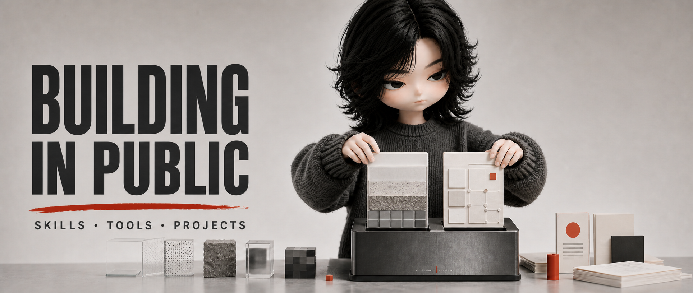

&nbsp;
&nbsp;

  

 

 

<strong>AI Product Manager · AIGC Designer · Indie Maker</strong>

## About Me

从 AIGC 设计师转型为 AI 产品经理，现在我也以独立制作者的方式持续构建 AI 应用、创作工具与可复用的 Skill。

我关注的不只是 AI “能不能生成”，更关心它能否被设计成清晰、稳定、可复用的产品体验：从需求判断、交互原型到工作流与视觉交付，让一个想法真正变成可以使用、可以验证的应用。

## What I'm Working On

🎨 把 AIGC 视觉方法沉淀为可复用的 Skill 与创作工具

🧭 将 AIGC 设计经验融入 AI 产品，持续进行需求判断、产品定义与原型验证

🧩 构建 AI 应用、AIGC 工作流与轻量产品原型

🛠️ 以独立制作者的方式持续发布、验证和迭代自己的作品

🔭 关注 AI 产品、设计工程与人机协作的新可能

## Three Hats

<table width="100%">
  <tr>
    <td width="33%" align="center" valign="top">
      <h3>🧭 AI Product Manager</h3>
      
        
      <strong>需求判断 · 产品定义 · 原型验证</strong>
        
      把 AI 能力变成可以使用、可以验证的产品。
    </td>
    <td width="33%" align="center" valign="top">
      <h3>🎨 AIGC Designer</h3>
      
        
      <strong>视觉系统 · 图像生成 · 设计质检</strong>
        
      把视觉判断沉淀为稳定、可复用的创作方法。
    </td>
    <td width="33%" align="center" valign="top">
      <h3>🛠️ Indie Maker</h3>
      
        
      <strong>Codex Skills · 公开构建 · 持续发布</strong>
        
      独立完成从想法、制作到发布与迭代。
    </td>
  </tr>
</table>

## Application Stack

**AI 应用**

  
  
  

**AIGC 应用**

  
  
  

**设计应用**

  
  
  

## Selected Builds

| Repository | What it does |
| --- | --- |
| [`texture-scan-collage`](https://github.com/zaoshangduziteng/texture-scan-collage) | 将普通照片转换为精确对位的局部材质扫描框拼贴。 |
| [`Editorial-IP-Visuals`](https://github.com/zaoshangduziteng/Editorial-IP-Visuals) | 为中文长内容建立固定 IP × 3D 编辑型配图系统。 |

## Research & Writing

从 AIGC 设计师到 AI 产品经理的转型复盘

AI 应用如何从想法走到可验证原型

把视觉判断封装成可复用的 AIGC Skill

独立制作者的 AI 产品构建与发布记录

## Contribution Snake

<picture>
  <source media="(prefers-color-scheme: dark)" srcset="https://raw.githubusercontent.com/zaoshangduziteng/zaoshangduziteng/output/github-snake-dark.svg" />
  <source media="(prefers-color-scheme: light)" srcset="https://raw.githubusercontent.com/zaoshangduziteng/zaoshangduziteng/output/github-snake.svg" />
  
</picture>

 

Designing with AI. Building in public.

